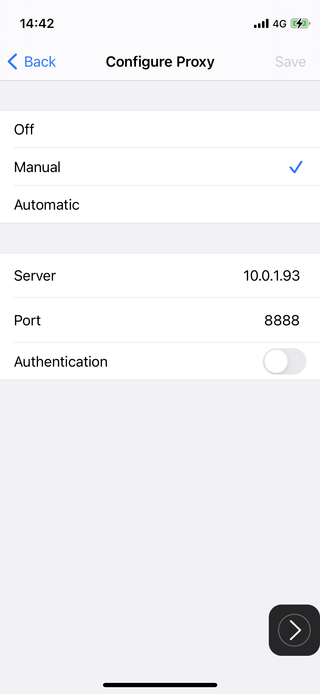
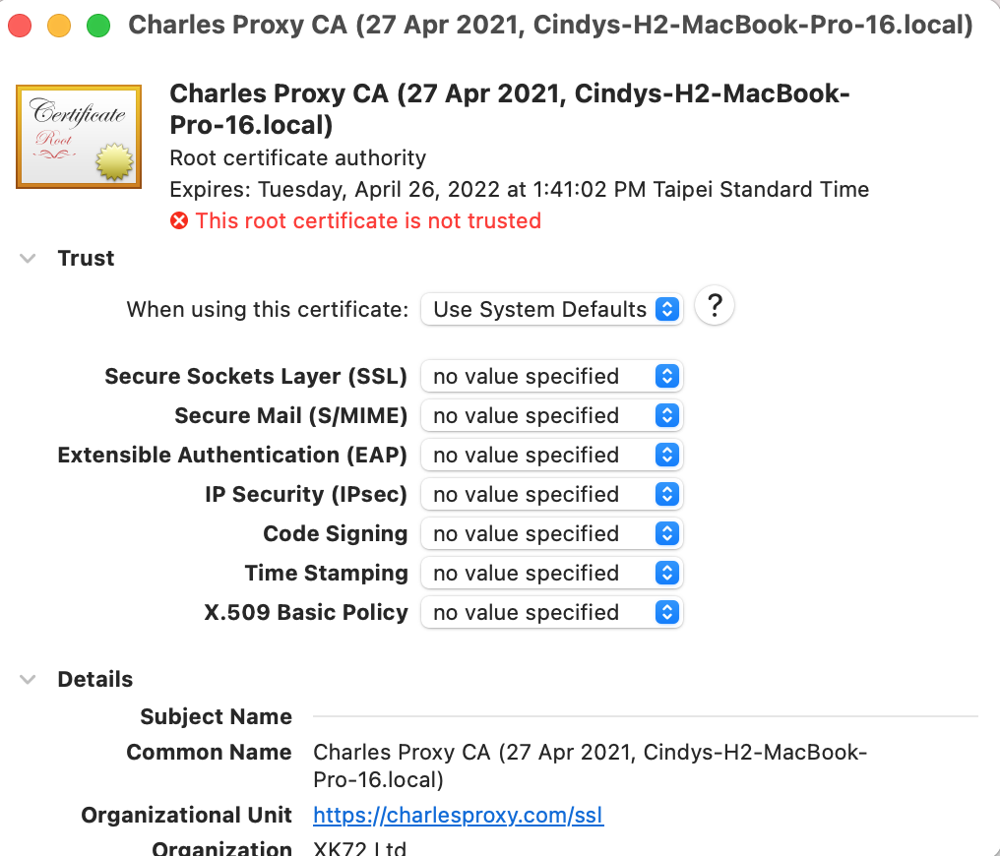
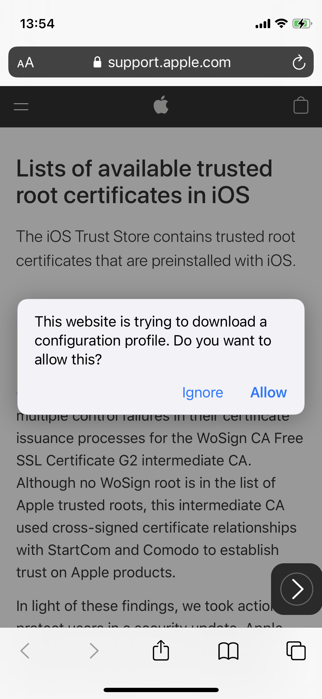
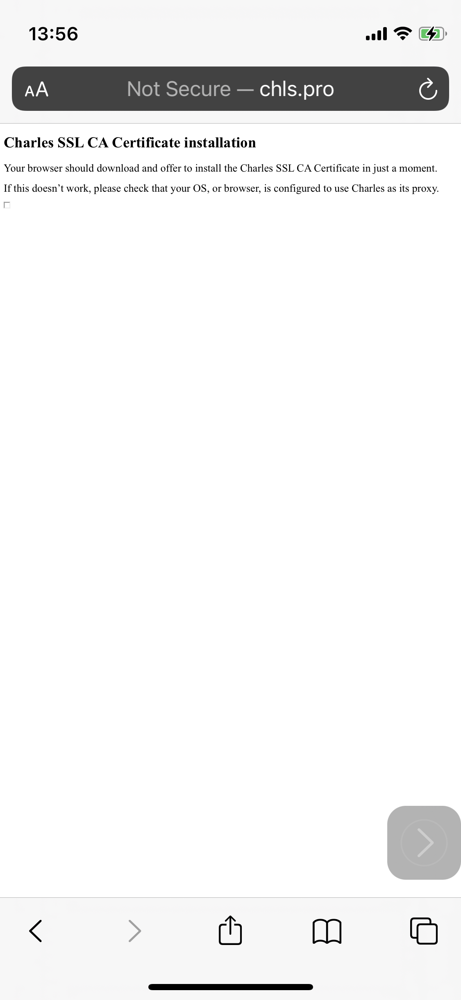
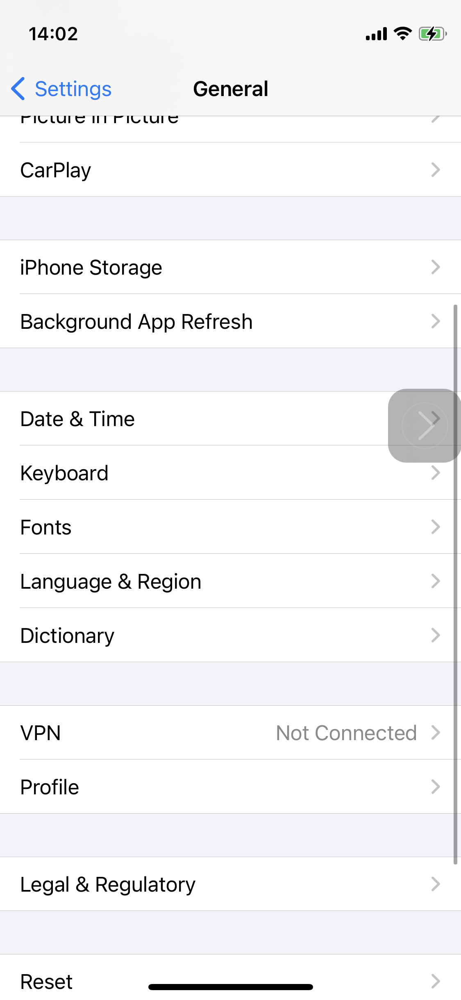
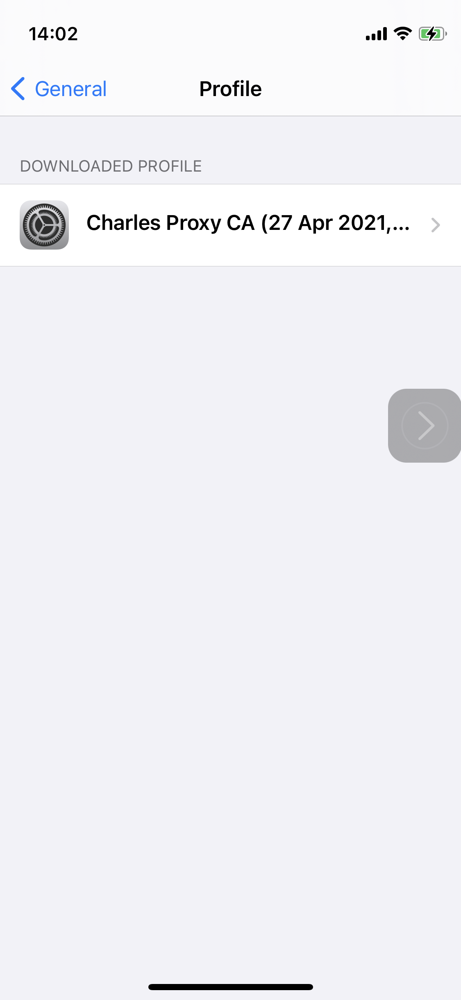
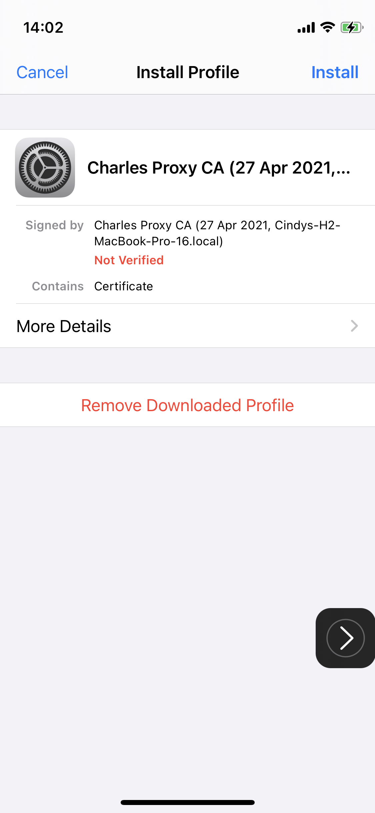
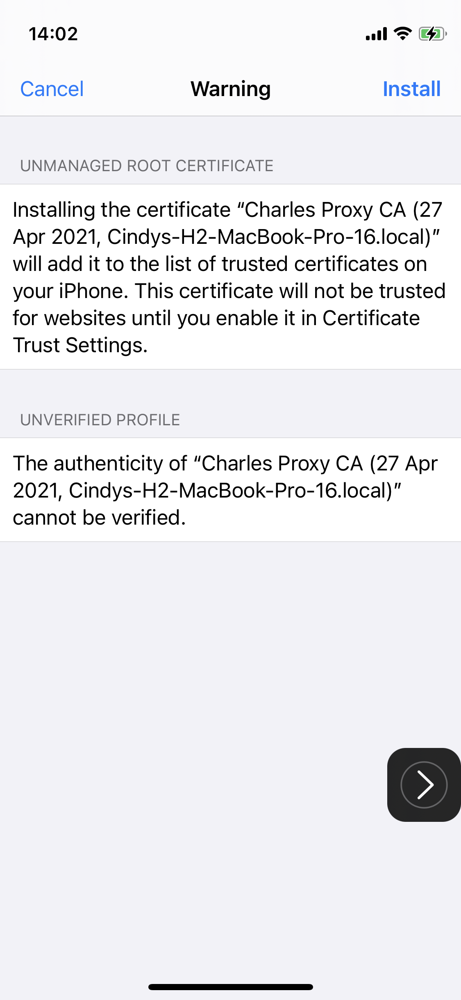
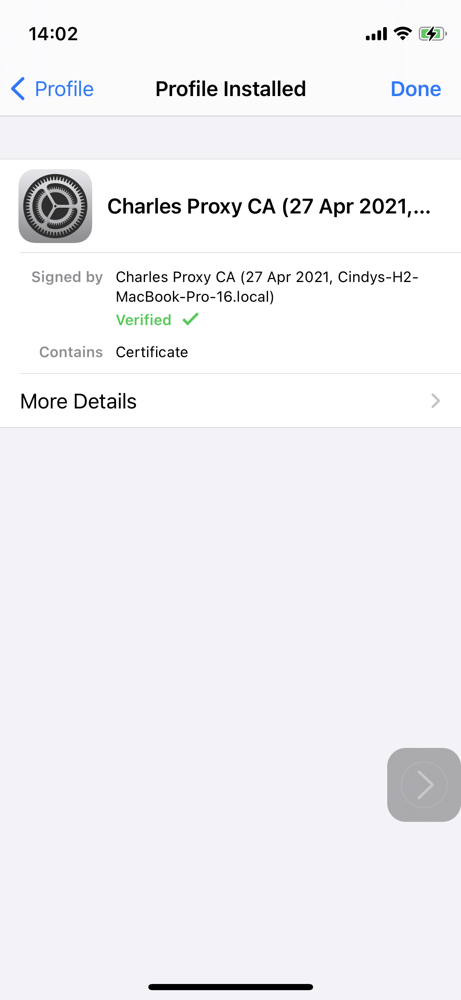
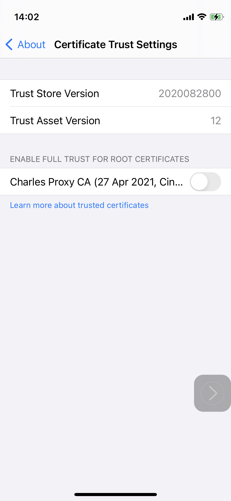

# Chales Proxy Installation

With proxy tool, Charles, we can observe API Endpoint, reqesut content and its headers for web and mobile.

This article will show you how to install Charles, set up profile on iPhone and check the API requests.

### 1. Download Charles

Charles Download Link: [https://www.charlesproxy.com/download/](https://www.charlesproxy.com/download/)

Open the dmg file and you will see the installation view.

Follow the instruction and finally drag Charles to Application folder.

### 2. Configure macOS Proxy Settings

Charles now has an automatic macOS Proxy Configuration, just tap **`Grant Privileges`** and let it do the job!

Insert password to install Charles Helper.

### 3. Configure iPhone Proxy Settings

Within Charles' Menu, we can see **`Help`** tab. Tap `Help` and choose **`Local IP Address`** .  
It will show you the computer's IP address.

Here, the IP Address is `10.0.1.93`

Go to Wifi's setting and choose the blue information button for the wifi that you're currently using.

You will see the wifi's detail page. Scroll to the bottom. You will see **`Configure Proxy`** option.

Choose `Manual` and enter the Local IP Address that we found in the previous step.  
Also enter `8888` as port and press the save button.

And the charles app on the mac will show and alert telling you a connection tries to establish.  
Tap `Allow` !

### 4. Install Charles Root Certificate on macOS

Go to Help in the Charles menu and search for `SLL Proxying` .  
Choose the option **`Install Charles Root Certificate`** .

Go to Keychain. In the System keychain, you will see a Charles Proxy CA in an invalid status.  
The cerficiate is currently invalid because it's not trusted.

We choose the Chalres Proxy CA and right tap it. Tap `Get Info` in order to trust the certificate.

Extend the `Trust` section and it will show `Use System Defaults` .

Let's change it to `Always Trust` .

And the Charles CA is trusted!

### 5. Install Charles Root Certificate on iPhone

Choose the Help menu in Charles again.  
This time we choose `Install Charles Root Certificate on a Mobile Device or Remote Browser`

Charles prompts an alert telling you that you have to first trust the Charles certificate in iPhone.

Open your Safari on iPhone, and go to website[ chls.pro/ssl](http://chls.pro/ssl) to download the profile.

It will prompt an alert to tell you that you're trying to download a profile. Tap `Allow`

You willl see this page when you successfully download the Charles certificate on iPhone.

Go to settings and tap `General` , find `Profile` and tap it.

You will find the certificate we just downloaded here in the Profile. We have to install the certificate we just downloaded. 

Tap `Install` and

It shows a warning just to check that installing this cerificate, it will add it to the trusted certificates on iPhone.

And finally, we have the root ceritifcate of Charles installed in our iPhone.

Go to **`General -> About -> Certificate Trust Settings`**

Turn on the switch to enable Carles certificate!

### 6. Enable SSL Proxying

Go to Charles app and choose the website you want to enable SSL Proxying.

Before proxy is enbaled, you will see unkown in the structure.

After proxy is enabled, you can see the detail API request, header and contents!

