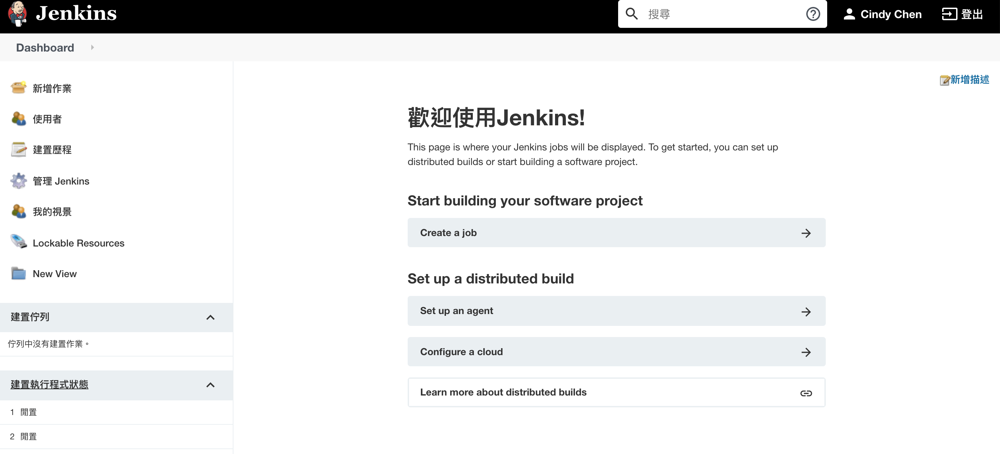

# First Jenkins Job

After[ installing Jenskins successfully](./), we logged in Jenkins by the admin we setted up earlier.   
Now, we're going to create our first Jenkins job.

### 1. Create a Free-Style Job

There are different project styles we can choose. Here we choose **Freestyle project** which we can do mich more customization settings**.**

Enter the item name and tap OK.

### 2. Add shell script for the Jenkins job

Leave all the sections blank and scroll to **Build Environment**.  
Choose the `Execute shell` as a build step.

Here, we simply add `Hello Jenkins` for the terminal to execute and save this settings.

After settings, we will come back to this Project page. Press the**`Build Now`** button to have our first Jenkins job going!

Soon, we can see the console output of the job we just created!  
It successfully executed the script we added, and printed `Hello Jenkins` in the console! 

